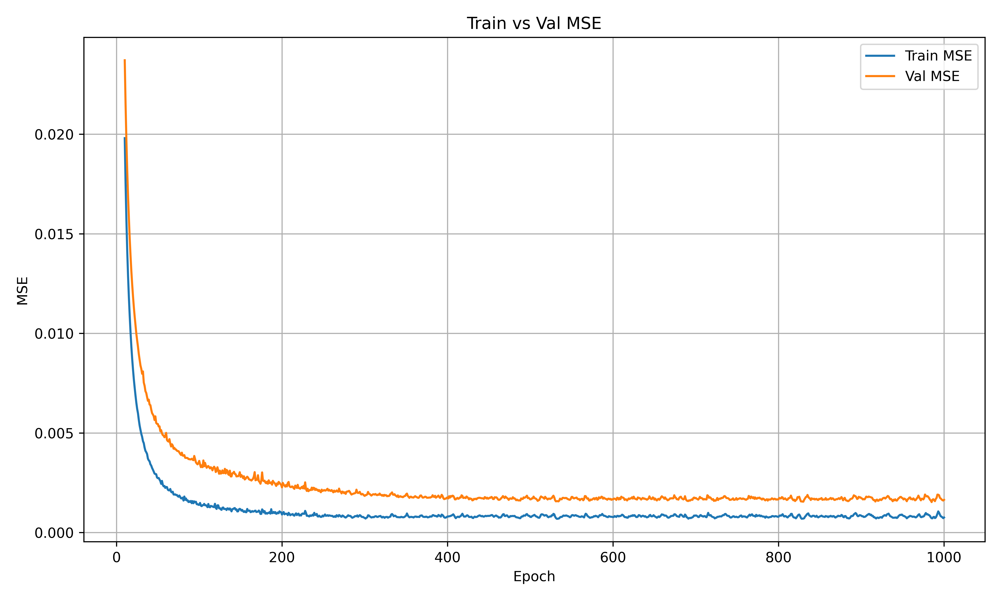
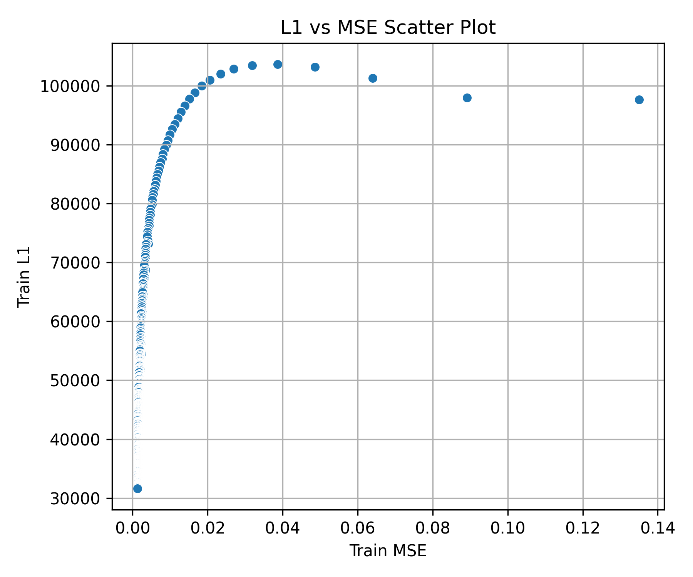
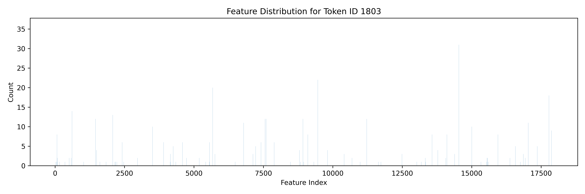
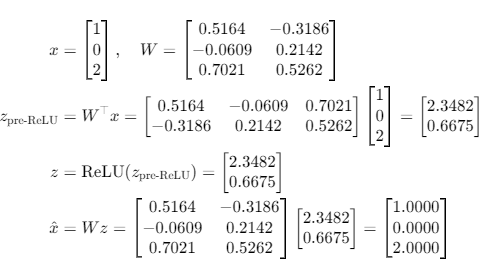
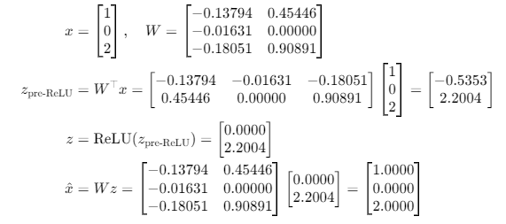
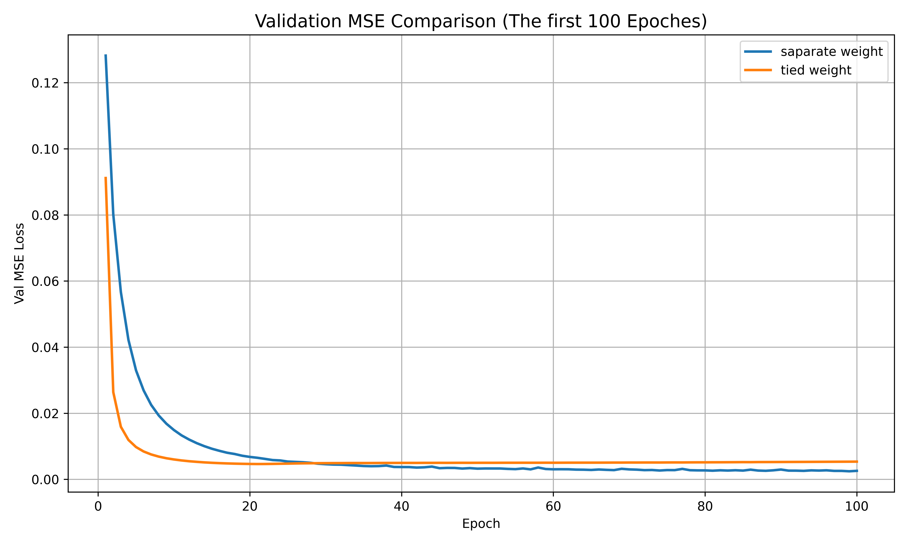

# What do we need to do?

This assignment requires us to train an **autoencoder** to interpret a **large language model** (LLM) on a specific or mulitple **topics** and conduct **intervention experiments**.

---

## 1. LLM: Qwen2.5-0.5B
- **Model Size**: 542M parameters  
  (For comparison: GPT-2 Medium: 345M, GPT-2 Large: 762M)
- **Advantages**:
  - Lightweight: can run on my laptop (~2 tokens/sec)
  - Trained on more data through **Knowledge Distillation**
  - Uses **modern training methods**: Instruction Learning and Reinforcement Learning from Human Feedback (RLHF)
- **Intermediate Layer**:
  - Hooked output from **decoder layer 15** (out of 24 total layers)
  - Dimension: 896

## 2. Topic: Transportation
- **Categories**: 30 types of transportation (e.g., Car, Bus, Truck, Motorcycle, Bicycle, Scooter)
- **Data Generation**:
  - For each category, generate 10 sentences by gpt like:  
    *"I saw a ***car*** on the way to school."*
    *"The ***Bus*** is parked outside the building."*
  - Use Qwen2.5-0.5B to do text continuation to get 300 short stories realated to transportation.

### 🧾 Prompt Format

```python
sentence = "I saw a car on the way to school."
prompt = f"Give me a short story that begins with: {sentence} \n\n"
prompt += "Try to include more transportation-related words in the story.\n\n"
prompt += "The story should contain at most 50 words"
```

### ✍️ Example Story Output

I saw a car on the way to school. As I drove, I noticed a familiar red car pulling up to the curb. The driver was a young man with a smile on his face. He was carrying a backpack and a backpack of books. I parked my car and walked towards him. He introduced himself and we started talking about his day.

- **Feature Generation**:
    - Use a hook to extract the activations from **decoder15** for the generated continuation tokens.
    - got **19K** tokens with thier activations (19K x 896).

## 3. Sparse Autoencoder: Vanilla Setting
- **Structure**:
    ```python
    z = nn.relu(nn.linear(input))
    output = nn.linear(z)
- **Loss Function**:
  - MSEloss + $\lambda$ * L1 Regularization
- **Dimensions**:
  - Input: 896
  - Latent: 896 x 20
  - Output: 896

### Training result





### Feature table for tokens
Based on the autoencoder, for the tokens $X = \{x_1, x_2, \dots, x_i\}$ that appear in the story, we can collect feature vectors for each token.

The feature vector of a token is computed as:

$$
\text{v}(x_i) = \frac{1}{n} \sum_{j=1}^{n} z_{ij}
$$

Note that a token $x_i$ may appear multiple times in the story, resulting in multiple corresponding latent vectors $z_{ij}$.




## 4. Intervention Experiment

- **Original** *(no intervention)*:  
  `LLM layer15 -> x -> LLM layer16`

- **Token Activation** *(intervention applied)*:  
  ```python
  z = SAE.encode(x)
  z = z + alpha * v
  x_modified = SAE.decode(z)

- **Token suppression** *(intervention applied)*:  
  ```python
  z = SAE.encode(x)
  z = z - beta * v
  x_modified = SAE.decode(z)

---

### Intervetion for multiple-choice question

**Original Output:**  
**Q:** Generally, which is smaller, a car or a train?  
**A:** *car.*

**Activate "train":**  
**Q:** Generally, which is smaller, a car or a train?  
**A:** *train*

**Suppress "car":**  
**Q:** Generally, which is smaller, a car or a train?  
**A:** *a train*
  
---

### Diverse Answer Control

#### 🔹 Content Control

**Activate `slowly`:**  
Q: Imagine a traffic scene.  
A: As the sun sets over the city, **a steady stream of cars** passes by, honing through the streets. The vehicles are a steady, rhythmic pattern, weaving through the city **like a slow, deliberate dance**. The cars are a mix of red, green, and yellow, as if on a parade down the road.

**Activate `quickly`:**  
Q: Imagine a traffic scene.  
A: A driver is driving through a **busy intersection**, trying to navigate through a jam of cars. **The traffic is moving at a high speed**, with many vehicles trying to make their way through the narrow lanes. The driver is trying to **make a quick decision** to avoid a collision, but is struggling to make a decision.

#### 🔹 Perspective/Style Control

**Activate `feeling`:**  
Q: Imagine a traffic scene.  
A: A bustling city filled with cars and people as the sun sets casting a golden glow over the city skyline. The traffic is heavy with cars honking and horns as people rushing to their destinations or trying to find their way through the city. **The city is a vibrant and dynamic place with its streets and buildings bustling with life**.

#### 🔹 Lexical Insertion

**Activate `glow`:**  
Q: Imagine a traffic scene.  
A: Traffic patterns are chaotic and unpredictable, with cars and buses moving in waves and lines, and pedestrians and cyclists jostling for space. **The sun is high and casting a golden glow over the landscape, but it's not enough to illuminate the road**. The sky is a shade of orange and pink, with clouds and raindrops dancing in the sunlight.

#### 🔹 Semantic Association

**Activate `day`:**  
Q: Imagine a traffic scene.  
A: In a bustling city, a driver is driving through a congested intersection. The driver is **late for a crucial meeting**, and the traffic is jammed with cars, trucks, and buses. The driver must navigate through the traffic, **trying to find a way to reach the destination before the meeting**.


# How about tied-weight?

It's feasible


---



## 📚 Recent work of Sparse Autoencoders (SAE)

- [**Hoagy Cunningham**](https://arxiv.org/abs/2309.08600v3) — *2023*  
  **Type**: Tied weights  
  One of the earliest and most influential works. Shows that sparse autoencoders can extract interpretable LLM features, such as *"sycophantic praise"* or *"the Golden Gate Bridge"*.

- [**TopKSAE**](https://arxiv.org/abs/2406.04093) — *OpenAI, 2024*  
  **Type**: Tied weights only for initialization  
  Proposes a scalable sparse autoencoder using tied weights for initialization. Achieves strong interpretability and efficient training.

- [**JumpReLU**](https://arxiv.org/abs/2407.14435) — *DeepMind, 2024*  
  **Type**: Tied weights only for initialization  
  Introduces JumpReLU, which decouples the ReLU encoder from the gating mechanism. Improves reconstruction fidelity but finds that untied designs don’t always yield benefits.

- [**GatedSAE**](https://arxiv.org/abs/2404.16014) — *DeepMind, 2024*  
  **Type**: Untied weights across encoder and decoder
  Introduces a gated multiplicative encoder structure. Achieves better feature specialization and improved dictionary learning.

## Insights on Tied Weights

- Reduce model memory usage by half without performance loss. [`Hoagy Cunningham`]  
- Provide a better initialization for faster training. [`GatedSAE`]  




The figure shows the training performance over the first 100 epochs. We observe that the tied-weight model converges faster.

# Areas for Improvement

- Try advanced autoencoders: JumpReLU, GatedSAE, TopKSAE, Batch Top-K.
- Monosemanticity is better. It makes it possible to find the meaning of a single feature.

# Acknowledgements

🙏  Special thanks to Greg and Somto for their valuable guidance and careful knowledge sharing.

# Reference
- **Assignment statement**: *assignment-4-brain-surgery.pdf*  
- **Claude research**: [Scaling Monosemanticity](https://transformer-circuits.pub/2024/scaling-monosemanticity/index.html)  
- **SAE implementations**:  
  - [Dictionary Learning by saprmarks](https://github.com/saprmarks/dictionary_learning)  
  - [SAELens by jbloomAus](https://github.com/jbloomAus/SAELens/tree/main)  
- **Blog overview**: [SAE Intuitions – A brief introduction to SAE in LLMs](https://adamkarvonen.github.io/machine_learning/2024/06/11/sae-intuitions.html)  
- **Recent SAE variants**:  
  - [`GatedSAE`](https://arxiv.org/abs/2404.16014) — Deepmind, 2024  
  - [`TopKSAE`](https://arxiv.org/abs/2406.04093) — Openai, 2024  
  - [`BatchTopKSAE`](https://arxiv.org/abs/2412.06410) — Bussmann et al., 2024  
  - [`JumpReLU`](https://arxiv.org/abs/2407.14435) — Deepmind, 2024
  - [Hoagy Cunningham et al.](https://arxiv.org/abs/2309.08600v3), 2023


