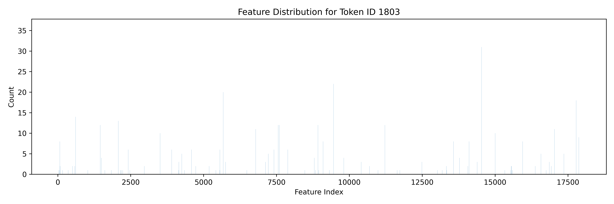

# What do we need to do?

This assignment requires us to train an **autoencoder** to interpret a **large language model** (LLM) on a specific **topic** and conduct **intervention experiments**.

---

# current progress

## 1. LLM: Qwen2.5-0.5B
- **Model Size**: 542M parameters  
  (For comparison: GPT-2 Medium: 345M, GPT-2 Large: 762M)
- **Advantages**:
  - Lightweight: can run on my laptop (~2 tokens/sec)
  - Trained on more data through **Knowledge Distillation**
  - Uses **modern training methods**: Instruction Learning and Reinforcement Learning from Human Feedback (RLHF)
- **Intermediate Layer**:
  - Hooked output from **decoder layer 15** (out of 24 total layers)
  - Dimension: 896

## 2. Topic: Transportation
- **Categories**: 30 types of transportation (e.g., Car, Bus, Truck, Motorcycle, Bicycle, Scooter)
- **Data Generation**:
  - For each category, generate 10 sentences by gpt like:  
    *"I saw a ***car*** on the way to school."*
    *"The ***Bus*** is parked outside the building."*
  - Use Qwen2.5-0.5B to do text continuation to get 300 short stories realated to transportation.

### Prompt Format:
```python
sentence = "I saw a car on the way to school."
prompt = f"Give me a short story that begins with: {sentence} \n\n"
prompt += "Try to include more transportation-related words in the story.\n\n"
prompt += "The story should contain at most 50 words"
```
- **Feature Generation**:
    - Use a hook to extract the activations from **decoder15** for the generated continuation tokens.
    - got **19K** tokens with thier features (19K x 896).

## 3. Sparse Autoencoder: Vanilla Setting
- **Structure**:
    ```python
    z = nn.relu(nn.linear(input))
    output = nn.linear(z)
- **Loss Function**:
  - Mean Squared Error (MSE) + L1 Regularization
- **Dimensions**:
  - Input: 896
  - Latent: 896 x 20
  - Output: 896

### Training result





## 4. Intervention Experiment

### Model Flow Overview

- **Original**:  
  `LLM layer15 -> x -> LLM layer16`

- **Through SAE only** (no intervention):  
  `LLM layer15 -> SAE(x) -> LLM layer16`

- **With Feature Activation** *(intervention applied)*:  
  ```python
  z = SAE.encode(x)
  z = z / 2  # suppress all features
  z[related_feature_index] += 1.0  # activate selected feature
  x_modified = SAE.decode(z)

---

### One Example

#### 🔹 Original Output:
**Q:** Generally, which is bigger, a car or a bus?  
**A:** *Bus.*

---

#### 🔹 Through SAE (No Intervention):
**Q:** Generally, which is bigger, a car or a bus?  
**A:** *It depends on the size and weight of the vehicle.*

---

#### 🔹 Activating Features of " car":
**Q:** Generally, which is bigger, a car or a bus?  
**A:** *a car*

---

#### 🔹 Activating Features of " bus":
**Q:** Generally, which is bigger, a car or a bus?  
**A:** *a bus. It is a more, crowded ...*


# Areas for Improvement

- Try advanced autoencoders: JumpReLU, GatedSAE, TopKSAE, Batch Top-K.
- Use more reliable metrics like L0 norm,  CE difference.
- Train on a larger dataset.
- Apply to larger LLMs.
- Explore more diverse and interesting intervention cases.


# Reference
- **Assignment statement**: *assignment-4-brain-surgery.pdf*  
- **Claude research**: [Scaling Monosemanticity](https://transformer-circuits.pub/2024/scaling-monosemanticity/index.html)  
- **SAE implementations**:  
  - [Dictionary Learning by saprmarks](https://github.com/saprmarks/dictionary_learning)  
  - [SAELens by jbloomAus](https://github.com/jbloomAus/SAELens/tree/main)  
- **Blog overview**: [SAE Intuitions – A brief introduction to SAE in LLMs](https://adamkarvonen.github.io/machine_learning/2024/06/11/sae-intuitions.html)  
- **Recent SAE variants**:  
  - [`GatedSAE`](https://arxiv.org/abs/2404.16014) — Rajamanoharan et al., 2024  
  - [`TopKSAE`](https://arxiv.org/abs/2406.04093) — Gao et al., 2024  
  - [`BatchTopKSAE`](https://arxiv.org/abs/2412.06410) — Bussmann et al., 2024  
  - [`JumpReLU`](https://arxiv.org/abs/2407.14435) — Rajamanoharan et al., 2024


